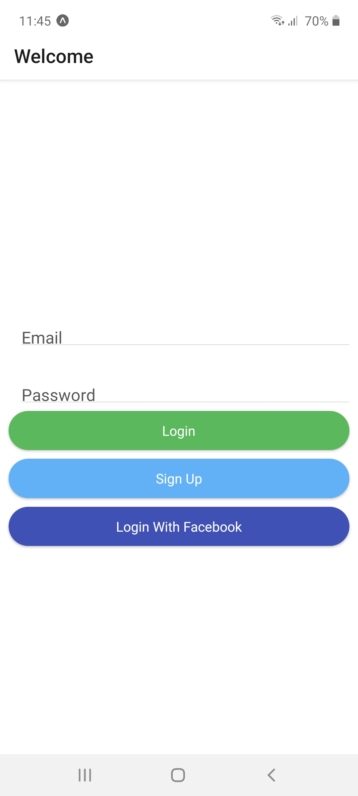
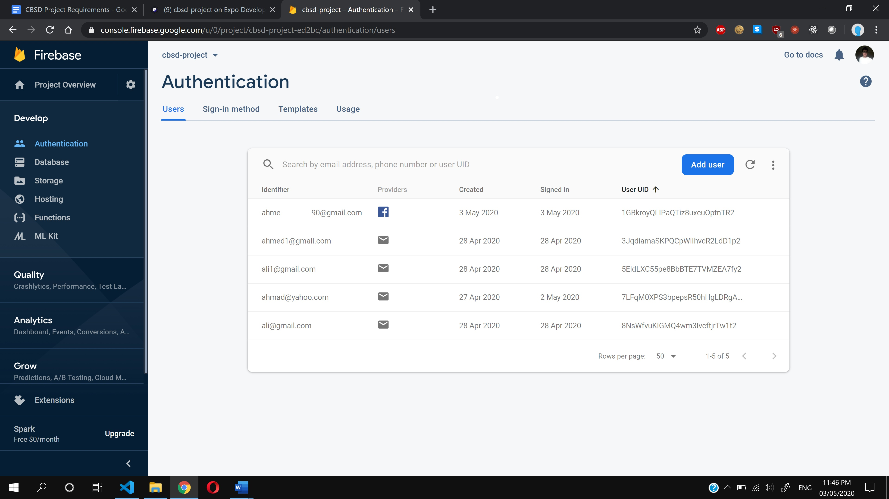
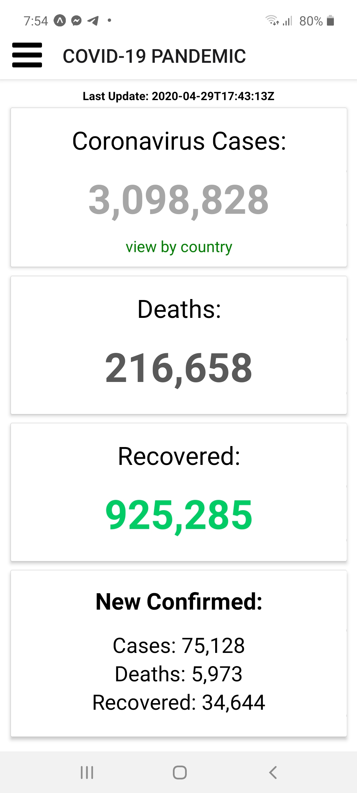
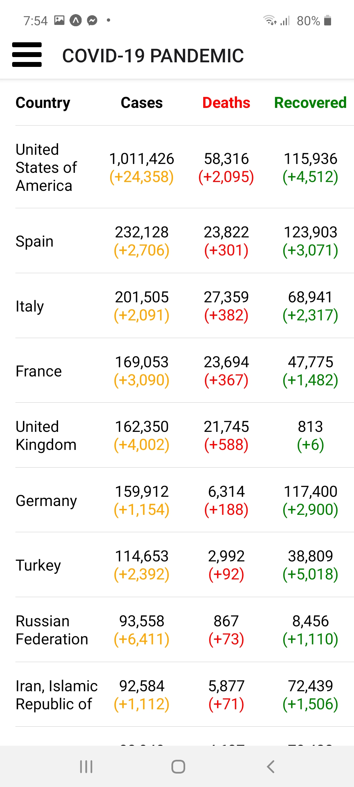
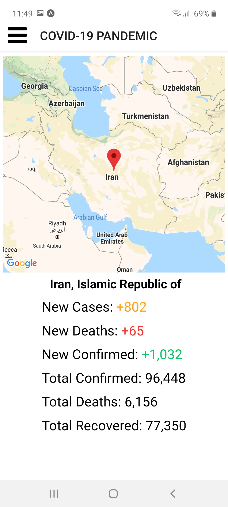
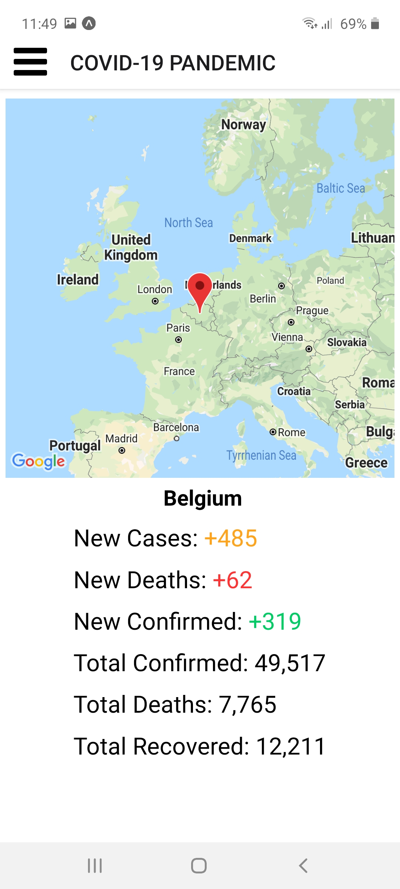
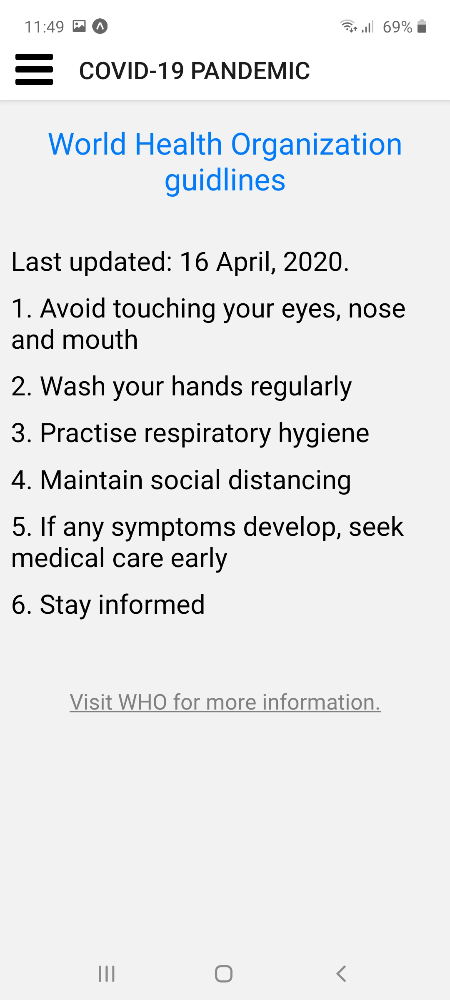
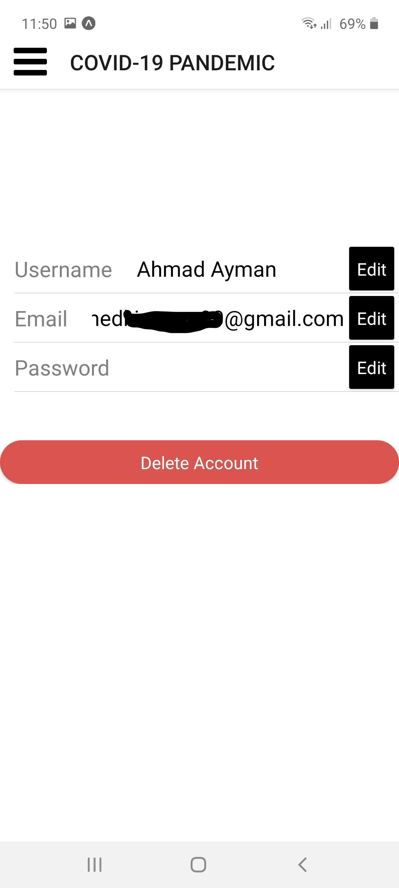
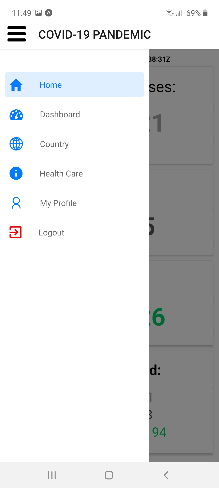
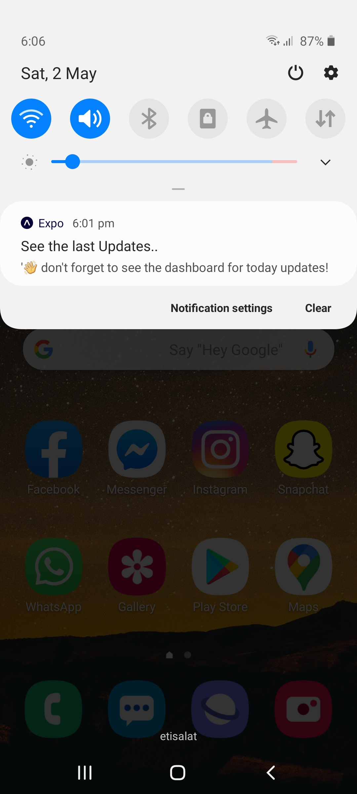

# Covid-19 Dashboard

## Introduction:
Covid-19 is one of the most dangerous things that happened to us, it affected many people and will most likely continue to affect more therefore the public need to have awareness and understanding of the importance of everyone's role. 
Mathematics help create a story, or a form of representation to predict the behavior of the disease because numbers always don't lie and it is better to prevent diseases rather than to try to find cures for them after they occur. The reasoning for that is like why you change the oil in your car rather than wait to fix a blown engine.

### Motivation:
-	our role as developers.
-	awareness is more important than cure.
-	Reduced pressure on hospitals.

### Why this Project:
Only way to Fight this pandemic is by avoiding large gatherings and by not going to high infected rate areas.
The application provides us with the latest numbers of the infection per country and provide the country location on the map.

### Objectives:
1.	reduce the burden on hospitals and get health instructions from our app.
2.	Inform the user with last updates of infection numbers and the countries location on the map.
3.	increase people awareness of how the situation has been constantly worse
4.	the sense of normalcy across the nation.

### Problem statement:
Covid-19 is very fast spreading disease with high transmission. The disease grows at exponential rate and most of the people do not sense the dangerous situation we are in. so there should be a fast forward way to get them the last updates and how is the disease close to us. Spot the countries on the map to visualize the situation.

 
## Project Design:
Every page (activity) in react native is counted as a component and that component is built up using other smaller components.

### Login component:
User can login, signup or login with facebook.

The data is saved in Realtime Database (Firebase).

### Summary component:
This is the home page and display the summary numbers of the cases, deaths and recoverd also display the last updated date and the newly confirmed numbers in this update in he bottom.
This component is made up from Smaller components called Cards and this cards have a header, body and footer.

### Dashboard component:
This component displays all the Infected countries sorted by total confirmed cases.
This component made up using list component offered by native-base library and we added the columns to it.
This component and the previous one take all the data from an API that will be mentioned in the refrences section.

### Country component:
When user click on any country in the dashboard the user will be redirected to the country page that pin this country on the map and display all the specific information to this country.
We used MapView component that we get from react-native-maps library that uses google maps API.
There is an API used to get the coordinations of the country and we pass the coordinates to the MapView component.

### HealthAdvice component:
We used component called cheeriofrom react-native-cheerio library that you can give URL to a HTML page and copy some data from that URL so this data is actullay loaded from another web page if they update their data it will reflect on our app.

### Profile component:
We save the user: username, email and password.
The user could edit any of them and also can delete his account.

### Navigation:
User could navigate through the application with the drawer once the user is signed in and could logout this email but you can not navigate the country component without choose one from the dashboard.

### Notification:
User will be notified if he did not open the app for this day.

## References:

- This App was built using [React-native](https://reactnative.dev/docs/getting-started)
- For the navigation [React-navigation](https://reactnavigation.org/docs/getting-started/)
- To add icons [Vector-icons](https://expo.github.io/vector-icons/)
- To get notification permission [Expo-permissions](https://docs.expo.io/versions/latest/sdk/permissions/)
- To get the data [Covid19-API](https://documenter.getpostman.com/view/10808728/SzS8rjbc?version=latest#63fda84a-6b43-4506-9cc7-2172561d5c16)
- To get countries coordinates [Coordinates-API](https://opencagedata.com/api)
- Login with Facebook [Expo-Facebook](https://docs.expo.io/versions/latest/sdk/facebook/)
- Add UI components [Native-base](https://docs.nativebase.io/)
- Add formats to numbers [Numeral](http://numeraljs.com/)
- Add Map View [React-native-maps](https://github.com/react-native-community/react-native-maps)
